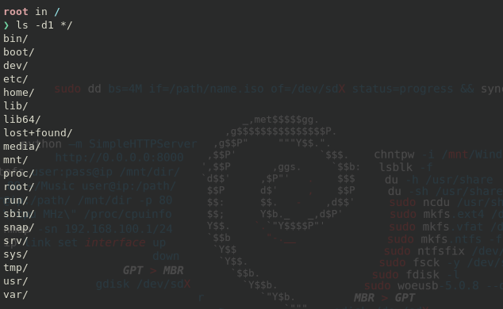

## The Linux filesystem is organized in tree structure with the
## main directory *root* at the top of hierarchy.

> Root directory is the starting point in the Linux
filesystem and it contains all other directories.


> This is the ***root*** directory and everything under that is just another directories.
```
/
```




> **Learning source from Article in *Wikipedia*** and different other blog-posts.
### Filesystem Hierarchy Standard (FHS)
> In the FHS all files and directories appear under the ***root directory*** **/**,
even if they are stored on different physical or virtua; devices.

| Directory | Description |
|:-----------:|:-----------:|
|     /      |     Primary hierarchy **root** and **root directory** of the entire file system.      |
|     /bin   |     Essential command **binaries** that need to be available in single-user mode,
inluding to bring up the system or repair it, for all users(e.g., **cat, ls, cp**)|
|     /boot  |     **Boot loader** files(e.g., kernels, intrd)      |
|     /dev   |     Device files(e.g., */dev/null, /dev/disk0, /dev/sdal, /dev/tty, /dev/random)      |
|     /etc   |     Host-specific system-wide *configuration files*. Document from Bell Labs */etc* is referred to as the *etcetera* directory, as this directory historically held everything that did not belong elsewhere(however, the FHS restricts */etc* to static configuration files and may not contain binaries). SInce the publication of early documentation, the directory name has been re-explained in various ways. Recent interpretation include *backronyms* such as *"Editable Text Configuration" or "Extended Tool Chest"*.      |
|     /etc/opt  |  Configuration files for add-on packages stored in */opt*.         |
|     /etc/sgml |  Configuration files, such as catalogs, for software that processes *SGML*.         |
|     /etc/X11  |  Configuration files for the *X Window System*, version 11.         |
|     /etc/xml  |  Configuration files, such as catalogs, for software that processes *XML*         |
|     /home     |  User's *home directories* containing saved files, personal settings, etc.         |
|           |           |
|           |           |
|           |           |
|           |           |
|           |           |
|           |           |
|           |           |
|           |           |
|           |           |
|           |           |


